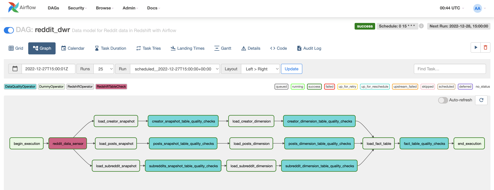
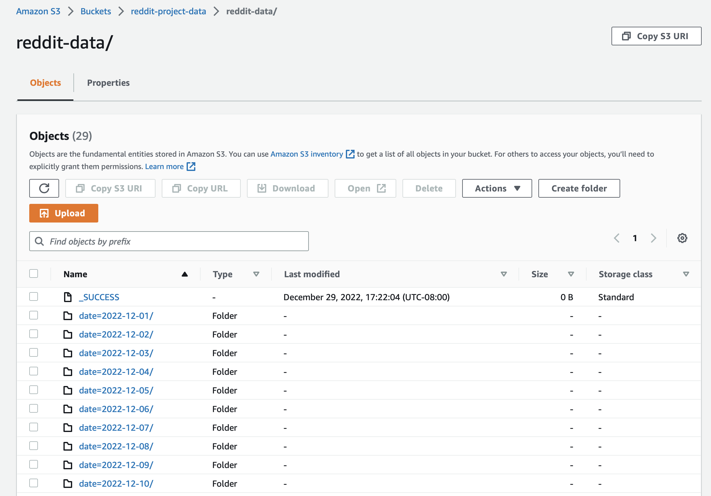

# Capstone project for Udacity's Data Engineering Nanodegree

## 1. Overview
The goal of this project is to create a Data Warehouse to analyze trending and new subreddits using Airflow.

The project uses the Reddit API to get subreddits and stores them on AWS S3 in JSON format. Data processing 
happens on an EMR cluster on AWS using PySpark and processed data gets stored on AWS S3 in parquet format. 
Finally, the data gets inserted into AWS Redshift, gets denormalized to create fact and dimension tables.

## Table of Content
[2. Datawarehouse Architecture](https://github.com/dsavg/capstone-data-engineering-project#2-datawarehouse-architecture)
[3. Set up](https://github.com/dsavg/capstone-data-engineering-project#3-set-up)  
[3.1. Amazon Web Servises](https://github.com/dsavg/capstone-data-engineering-project#31-amazon-web-servises)  
[3.2. Reddit API](https://github.com/dsavg/capstone-data-engineering-project#32-reddit-api)  
[3.3. Airflow (v2.3.0) ](https://github.com/dsavg/capstone-data-engineering-project#33-airflow-v230)  
[4. Data Warehouse](https://github.com/dsavg/capstone-data-engineering-project#4-data-warehouse)  
[4.1. DAGs](https://github.com/dsavg/capstone-data-engineering-project#41-dags)  
[4.1.1. reddit_get_api_data](https://github.com/dsavg/capstone-data-engineering-project#411-reddit_get_api_data)  
[4.1.2. reddit_processing_dag](https://github.com/dsavg/capstone-data-engineering-project#412-reddit_processing_dag)  
[4.1.3. reddit_dwr_dag](https://github.com/dsavg/capstone-data-engineering-project#413-reddit_dwr_dag)  
[4.2. Custom Operators](https://github.com/dsavg/capstone-data-engineering-project#42-custom-operators)  
[5. Data Model](https://github.com/dsavg/capstone-data-engineering-project#5-data-model)  
[6. S3 Data Storage](https://github.com/dsavg/capstone-data-engineering-project#6-s3-data-storage)
[7. Data Justifications](https://github.com/dsavg/capstone-data-engineering-project#7-data-justifications)
[8. Resources](https://github.com/dsavg/capstone-data-engineering-project#8-resources)

## 2. Datawarehouse Architecture


## 3. Set up
### 3.1. Amazon Web Servises
* Create an IAM Role on AWS with the following attached policies [link](https://docs.aws.amazon.com/IAM/latest/UserGuide/intro-structure.html),
    * `AdministratorAccess`
    * `AmazonRedshiftFullAccess`
    * `AmazonS3FullAccess`   
    
    Save the `Access key ID` and `Secret access key` to use in Airflow later.
* Create an S3 bucket named `reddit-project-data`.
* Create a Redshift cluster on AWS, which is publicly accessible and has enhanced VPC routing.

### 3.2. Reddit API
Following the steps in [How to Use the Reddit API in Python](https://towardsdatascience.com/how-to-use-the-reddit-api-in-python-5e05ddfd1e5c) medium post, set up your credentials for the Reddit API. Ones you've done that, you will need the keep the following information to use in Airflow later.
* `client_id`
* `client_secret`
* `password`
* `user_agent`
* `username`  

### 3.3. Airflow (v2.3.0) 
Follow the [How to Run Airflow Locally With Docker](https://towardsdatascience.com/run-airflow-docker-1b83a57616fb) to start running your Airflow locally. Attached steps bellow,
1. Clone this repo and move to it's directory
```
$ git clone git@github.com:dsavg/capstone-data-engineering-project.git
```
2. Fetch the docker yaml file from airflow   
```
$ curl -LfO 'https://airflow.apache.org/docs/apache-airflow/2.3.0/docker-compose.yaml'
```
3. Create a folder to store the Airflow logs
```
$  mkdir ./logs
```
4. Set up an Airflow user and store in .env
```
echo -e "AIRFLOW_UID=$(id -u)\nAIRFLOW_GID=0" > .env
```
5. Initialise the Airflow db
```
docker-compose up airflow-init
```
6. Start Airflow service
```
docker-compose up
```
7. Open [localhost:8080](localhost:8080) on a browser 

8. When the docker container is up and running, you will need to create the following connections and variables in the Airflow environment.  
    
    **Variables**
    

    **Connections**
    
    * Connection Id = **aws_credentials**   
    Connection Type = Amazon Web Services   
    Login = {{`Access key ID`}}   
    Passwork = {{`Secret access key`}}
    
    * Connection Id = **aws_default**   
    Connection Type = Amazon Web Services   
    Login = {{`Access key ID`}}   
    Passwork = {{`Secret access key`}}  
    Extra = {"region_name": "us-west-2"}
    
    * Redshift connection
    

9. When done with this project, you can go ahead and stop and delete all running containers
```
docker-compose down --volumes --rmi all
```

## 4. Data Warehouse
### 4.1. DAGs
#### 4.1.1. reddit_get_api_data
##### Overview
The Dag gets data from the Reddit API in a JSON format and stores them in AWS S3. 
##### Graph

##### Tasks
* `begin_execution`: uses the [DummyOperator](https://airflow.apache.org/docs/apache-airflow/2.3.1/_modules/airflow/operators/dummy_operator.html#DummyOperator) operator to indicate the start of the DAG.
* `get_reddit_data`: uses the [RedditΤoS3Operator](https://github.com/dsavg/capstone-data-engineering-project/blob/master/plugins/operators/reddit_api.py) custom operator to fetch trending world-news subreddit data and store them in AWS S3 in JSON format.
* `end_execution`: uses the [DummyOperator](https://airflow.apache.org/docs/apache-airflow/2.3.1/_modules/airflow/operators/dummy_operator.html#DummyOperator) operator to indicate the end of the DAG.

#### 4.1.2. reddit_processing_dag
##### Overview
The Dag reads the Reddit JSON logs from AWS S3, unnests all wanted fields using pySpark on an EMR cluster, and stores them back in S3 in a parquet format.  
##### Graph


##### Tasks
* `begin_execution`: uses the [DummyOperator](https://airflow.apache.org/docs/apache-airflow/2.3.1/_modules/airflow/operators/dummy_operator.html#DummyOperator) operator to indicate the start of the DAG.
* `reddit_s3_data_sensor`: uses the [S3PartitionCheck](https://github.com/dsavg/capstone-data-engineering-project/blob/master/plugins/operators/s3_partition_check.py) custom operator to check if the date partition exists in S3. The task fails and retries if data does not exist. 
* `create_emr_cluster`: uses the [EmrCreateJobFlowOperator](https://airflow.apache.org/docs/apache-airflow-providers-amazon/stable/_modules/airflow/providers/amazon/aws/operators/emr.html#EmrCreateJobFlowOperator) operator to create an EMR cluster in AWS with [JOB_FLOW_OVERRIDES](https://github.com/dsavg/capstone-data-engineering-project/blob/master/plugins/helpers/emr_utils.py) settings.
* `script_to_s3`: uses the [PythonOperator](https://airflow.apache.org/docs/apache-airflow/stable/_modules/airflow/operators/python.html#PythonOperator) operator to copy the [s3_to_parquet.py](https://github.com/dsavg/capstone-data-engineering-project/blob/master/plugins/helpers/s3_to_parquet.py) pySpark script to s3 to execute on EMR.
* `add_steps`: uses the [EmrAddStepsOperator](https://airflow.apache.org/docs/apache-airflow-providers-amazon/stable/_modules/airflow/providers/amazon/aws/operators/emr.html#EmrAddStepsOperator) operator to exectute the [s3_to_parquet.py](https://github.com/dsavg/capstone-data-engineering-project/blob/master/plugins/helpers/s3_to_parquet.py) on the EMR cluster.
* `watch_step`: uses the [EmrStepSensor](https://airflow.apache.org/docs/apache-airflow/1.10.13/_modules/airflow/contrib/sensors/emr_step_sensor.html) operator to wait the prior EMR steps to complete.
* `terminate_emr_cluster`: uses the [EmrTerminateJobFlowOperator](https://airflow.apache.org/docs/apache-airflow/1.10.14/_modules/airflow/contrib/operators/emr_terminate_job_flow_operator.html) operator to terminate the EMR cluster created earlier.
* `end_execution`: uses the [DummyOperator](https://airflow.apache.org/docs/apache-airflow/2.3.1/_modules/airflow/operators/dummy_operator.html#DummyOperator) operator to indicate the end of the DAG.

#### 4.1.3. reddit_dwr_dag
##### Overview
The Dag load and transform Reddit data in Redshift with Airflow.
##### Graph

##### Tasks
* `begin_execution`: uses the [DummyOperator](https://airflow.apache.org/docs/apache-airflow/2.3.1/_modules/airflow/operators/dummy_operator.html#DummyOperator) operator to indicate the start of the DAG.
* `create_reddit_schema`: uses the [RedshiftOperator](https://github.com/dsavg/capstone-data-engineering-project/blob/master/plugins/operators/redshift_op.py) operator that executes the [dags/resources/create_schema.sql](https://github.com/dsavg/capstone-data-engineering-project/blob/master/dags/resources/create_schema.sql) query to create the `reddit` schema, if it does not already exist.
* `reddit_data_sensor`: uses the [S3PartitionCheck](https://github.com/dsavg/capstone-data-engineering-project/blob/master/plugins/operators/s3_partition_check.py) custom operator that to check if the data partition exists in S3. The task fails and retries if data does not exist.
* `create_stagging_table`: uses the [RedshiftOperator](https://github.com/dsavg/capstone-data-engineering-project/blob/master/plugins/operators/redshift_op.py) operator that executes the [dags/resources/create_stagging_table.sql](https://github.com/dsavg/capstone-data-engineering-project/blob/master/dags/resources/create_stagging_table.sql) query to to create the `reddit.staging_reddit_logs` table.
* `stage_reddit_data`: uses the [StageToRedshiftOperator](https://github.com/dsavg/capstone-data-engineering-project/blob/master/plugins/operators/stage_redshift.py) custom operator to copy the parquet logs to Redshift.
* `load_reddit_data`: uses the [RedshiftOperator](https://github.com/dsavg/capstone-data-engineering-project/blob/master/plugins/operators/redshift_op.py) operator that executes the [dags/resources/reddit_logs.sql](https://github.com/dsavg/capstone-data-engineering-project/blob/master/dags/resources/reddit_logs.sql) query to create the `reddit.reddit_logs` table.
* `load_creator_snapshot`: uses the [RedshiftOperator](https://github.com/dsavg/capstone-data-engineering-project/blob/master/plugins/operators/redshift_op.py) operator that executes the [dags/resources/creators_snapshot.sql](https://github.com/dsavg/capstone-data-engineering-project/blob/master/dags/resources/creators_snapshot.sql) query to create the `reddit.creators_snapshot` table.
* `load_creator_dimension`: uses the [RedshiftOperator](https://github.com/dsavg/capstone-data-engineering-project/blob/master/plugins/operators/redshift_op.py) operator that executes the [dags/resources/creators_dimension.sql](https://github.com/dsavg/capstone-data-engineering-project/blob/master/dags/resources/creators_dimension.sql) query to create the `reddit.creators_d` table.
* `creator_dimension_table_quality_checks`: uses the [DataQualityOperator](https://github.com/dsavg/capstone-data-engineering-project/blob/master/plugins/operators/data_quality.py) custom operator that ensures no Null values for primary keys and more than 0 records on tables.
* `load_posts_snapshot`: uses the [RedshiftOperator](https://github.com/dsavg/capstone-data-engineering-project/blob/master/plugins/operators/redshift_op.py) operator that executes the [dags/resources/posts_snapshot.sql](https://github.com/dsavg/capstone-data-engineering-project/blob/master/dags/resources/posts_snapshot.sql) query to create the `reddit.post_snapshot` table.
* `load_posts_dimension`: uses the [RedshiftOperator](https://github.com/dsavg/capstone-data-engineering-project/blob/master/plugins/operators/redshift_op.py) operator that executes the [dags/resources/posts_dimension.sql](https://github.com/dsavg/capstone-data-engineering-project/blob/master/dags/resources/posts_dimension.sql) query to create the `reddit.post_d` table.
* `posts_dimension_table_quality_checks`: uses the [DataQualityOperator](https://github.com/dsavg/capstone-data-engineering-project/blob/master/plugins/operators/data_quality.py) custom operator that ensures no Null values for primary keys and more than 0 records on tables.
* `load_subreddit_snapshot`: uses the [RedshiftOperator](https://github.com/dsavg/capstone-data-engineering-project/blob/master/plugins/operators/redshift_op.py) operator that executes the [dags/resources/subreddit_snapshot.sql](https://github.com/dsavg/capstone-data-engineering-project/blob/master/dags/resources/subreddit_snapshot.sql) query to create the `reddit.subreddit_snapshot` table.
* `load_subreddit_dimension`: uses the [RedshiftOperator](https://github.com/dsavg/capstone-data-engineering-project/blob/master/plugins/operators/redshift_op.py) operator that executes the [dags/resources/subreddit_dimension.sql](https://github.com/dsavg/capstone-data-engineering-project/blob/master/dags/resources/subreddit_dimension.sql) query to create the `reddit.subreddit_d` table.
* `subreddit_dimension_table_quality_checks`: uses the [DataQualityOperator](https://github.com/dsavg/capstone-data-engineering-project/blob/master/plugins/operators/data_quality.py) custom operator that ensures no Null values for primary keys and more than 0 records on tables.
* `dim_table_complete`: uses the [DummyOperator](https://airflow.apache.org/docs/apache-airflow/2.3.1/_modules/airflow/operators/dummy_operator.html#DummyOperator) operator to indicate that the dimension tables are ready.
* `load_fact_table`: uses the [RedshiftOperator](https://github.com/dsavg/capstone-data-engineering-project/blob/master/plugins/operators/redshift_op.py) operator that executes the [dags/resources/resources/fact_table.sql](https://github.com/dsavg/capstone-data-engineering-project/blob/master/dags/resources/fact_table.sql) query to create the `reddit.reddit_fact` table. query to
* `fact_table_quality_checks`: uses the [DataQualityOperator](https://github.com/dsavg/capstone-data-engineering-project/blob/master/plugins/operators/data_quality.py) operator that ensures no Null values for primary keys and more than 0 records on tables.
* `end_execution`: uses the [DummyOperator](https://airflow.apache.org/docs/apache-airflow/2.3.1/_modules/airflow/operators/dummy_operator.html#DummyOperator) operator to indicate the end of the DAG.

### 4.2. Custom Operators
[RedditΤoS3Operator](https://github.com/dsavg/capstone-data-engineering-project/blob/master/plugins/operators/reddit_api.py): Operator to get API Reddit data and store them in S3 in JSON format.  
[S3PartitionCheck](https://github.com/dsavg/capstone-data-engineering-project/blob/master/plugins/operators/s3_partition_check.py): Operator to check if the date partition exists in S3 path.  
[StageToRedshiftOperator](https://github.com/dsavg/capstone-data-engineering-project/blob/master/plugins/operators/stage_redshift.py): Operator to load parquet from S3 to Redshift. 
[RedshiftOperator](https://github.com/dsavg/capstone-data-engineering-project/blob/master/plugins/operators/redshift_op.py): [PostgresOperator](https://airflow.apache.org/docs/apache-airflow-providers-postgres/stable/operators/postgres_operator_howto_guide.html) modified operator to turn the `sql` and `params` fields to templated fields.  
[DataQualityOperator](https://github.com/dsavg/capstone-data-engineering-project/blob/master/plugins/operators/data_quality.py): Operator to check if the data output is as expected. 

## 5. Data Model
**Main Tables**  


**Helper Tables**


## 6. S3 Data Storage
Here is the s3 bucket `reddit-project-data` file structure 


`raw-json-logs` json files stored following


`reddit-data` parquet files stored following



## 7. Data Justifications
This sections addresses a few write up justifications as requested per Udacity's rubric.  

**Scenarios**
* The data was increased by 100x.  

    Since we are managing the amount of responses we are getting from the Reddit API, an increase 
by 100x of the data should be caused by someone manually increasing the limit of requests. In that 
case, S3 should be able to easily handle the increase, since the data is already partitioned by 
date. The EMR cluster can easily be scaled up in order to handle the increase in the data volume. 
Finally, if a degraded performance is observed on the Redshift cluster, we can increase the node 
size and the number of nodes.

* The pipelines would be run on a daily basis by 7 am every day.

    There is a cron expression for all DAGs to get triggered at 7am PST every day. Since data 
sensors are put in place in the DAGs, they will only run after their dependencies are complete
and not in parallel.

* The database needed to be accessed by 100+ people.

    The Redshift Cluster can be configured to handle 100+ users with concurrent query requests. 
  
**Additional Justifications**
* Technology used justification  

    * Airflow: open source and easy to configure.   
    * AWS S3: scalable, performant, and secure data storage solution.   
    * AWS EMR: great data processing solution, which is scalable and can be configured to use Spark and Hadoop.   
    * PySpark: easy to process large data with Python.   
    * AWS Redshift: relational database that is scalable and allows queries from multiple users    

* Why do you use star schema? Does it have any advantage compared to other schemas?

    A star schema is used for this project to denormalize subreddit data into a fact and 
dimensions tables.

* How often the data should be updated?  

    The DAGs are scheduled to run on a daily basis. In case one updates the data manually, by triggering a 
backfill for a given date, the original data will be overwritten. Note that in case
the reddit_get_api_data DAG gets updated, the new data might differ from the original, since they represent
a snapshot of the most popular subreddits at the time of the request. 

## 8. Resources
* https://towardsdatascience.com/run-airflow-docker-1b83a57616fb
* https://www.startdataengineering.com/post/how-to-submit-spark-jobs-to-emr-cluster-from-airflow/
* https://towardsdatascience.com/how-to-use-the-reddit-api-in-python-5e05ddfd1e5c