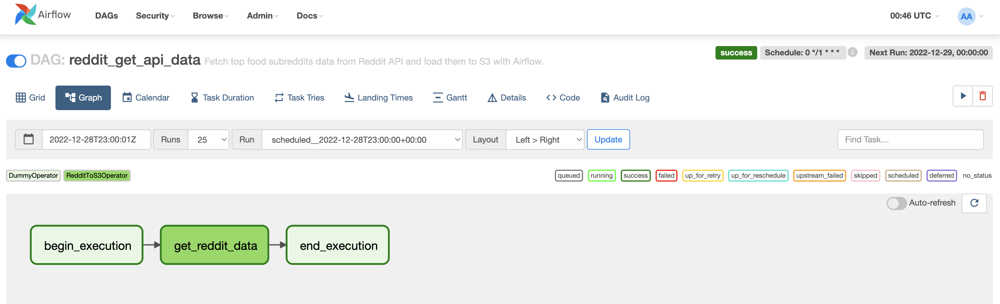
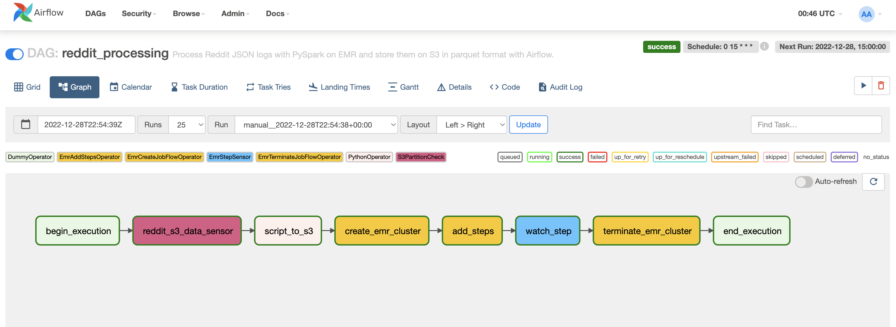

# Capstone project for Udacity's Data Engineering Nanodegree
Project is work in progress, stay tuned...

## 1. Set up
### 1.1. Amazon Web Servises
* Create an IAM Role on AWS with the following attached policies [link](https://docs.aws.amazon.com/IAM/latest/UserGuide/intro-structure.html),
    * `AdministratorAccess`
    * `AmazonRedshiftFullAccess`
    * `AmazonS3FullAccess`   
    
    Save the `Access key ID` and `Secret access key` to use in Airflow later.
* Create an S3 bucket named `reddit-project-data`.

### 1.2. Reddit API
Follow the [How to Use the Reddit API in Python](https://towardsdatascience.com/how-to-use-the-reddit-api-in-python-5e05ddfd1e5c) post to set up your credentials for the Reddit API. Ones you've done that, you will need the save the 
* `client_id`
* `client_secret`
* `password`
* `user_agent`
* `username`  

to use it in Airflow later. 

### 1.3. Airflow (v2.3.0) 
Follow the [How to Run Airflow Locally With Docker](https://towardsdatascience.com/run-airflow-docker-1b83a57616fb) to start running your Airflow locally. Attached steps bellow,
1. Clone this repo and move to it's directory
```
$ git clone git@github.com:dsavg/capstone-data-engineering-project.git
```
2. Fetch the docker yaml file from airflow   
```
$ curl -LfO 'https://airflow.apache.org/docs/apache-airflow/2.3.0/docker-compose.yaml'
```
3. Create a folder to store the Airflow logs
```
$  mkdir ./logs
```
4. Set up an Airflow user and store in .env
```
echo -e "AIRFLOW_UID=$(id -u)\nAIRFLOW_GID=0" > .env
```
5. Initialise the Airflow db
```
docker-compose up airflow-init
```
6. Start Airflow service
```
docker-compose up
```
7. Open [localhost:8080](localhost:8080) on a browser 

8. When the docker container is up and running, you will need to create the following connections and variables in the Airflow environment.  
    
    **Variables**
    

    **Connections**
    
    * Connection Id = **aws_credentials**   
    Connection Type = Amazon Web Services   
    Login = {{`Access key ID`}}   
    Passwork = {{`Secret access key`}}
    
    * Connection Id = **aws_default**   
    Connection Type = Amazon Web Services   
    Login = {{`Access key ID`}}   
    Passwork = {{`Secret access key`}}  
    Extra = {"region_name": "us-west-2"}

9. When done with this project, you can go ahead and stop and delete all running containers
```
docker-compose down --volumes --rmi all
```

## 2. Data Warehouse
### 2.1. DAGs
#### 2.1.1. reddit_get_api_data


#### 2.1.2. reddit_processing_dag


#### 2.1.2. reddit_dwr_dag
TO DO

### 2.2. Custom Operators
[RedditΤoS3Operator](https://github.com/dsavg/capstone-data-engineering-project/blob/master/plugins/operators/reddit_api.py): Operator to get API Reddit data and store them in S3 in JSON format.

[S3PartitionCheck](https://github.com/dsavg/capstone-data-engineering-project/blob/master/plugins/operators/s3_partition_check.py): Operator to check is date partition exists in S3 path.

## Resources
* https://towardsdatascience.com/run-airflow-docker-1b83a57616fb
* https://www.startdataengineering.com/post/how-to-submit-spark-jobs-to-emr-cluster-from-airflow/
* https://towardsdatascience.com/how-to-use-the-reddit-api-in-python-5e05ddfd1e5c